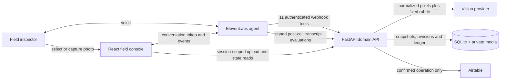
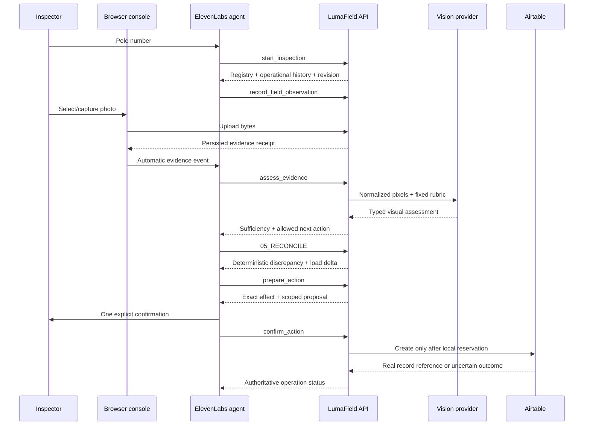

# LumaField

> LumaField reconciles what utilities have on record with what actually exists in the street.

LumaField is a voice-first field workflow for public-lighting assets. It turns an inspection into auditable evidence for asset, energy, and billing reconciliation: the operator identifies a pole, the system retrieves the utility record, field and visual evidence are captured independently, and the backend determines whether the physical asset matches the system of record.

LED recognition is a sensor inside the product, not the product itself. The business event is the discrepancy: technology, installed load, operating state, location, or even the existence of the point may differ from the record used by operational and billing processes.

The demo was built as a technical take-home for ElevenLabs and uses the platform for voice, workflow orchestration, tests, grounded domain knowledge, post-call analysis, and an authenticated audit webhook.

## The experience

The console is deliberately split into two surfaces. **New Inspection** is the field queue and live voice workflow; it starts with only the queue and one voice action, then reveals the workflow strip, utility record, field evidence, camera, reconciliation, and resolution only as the authoritative stage reaches them. **Inspections** is the separate read surface for portfolio indicators, persisted history, and a selected inspection dossier.

| Surface | Primary job | What is visible |
|---|---|---|
| **New Inspection** | Execute field work | The live queue and a single voice action at rest; the active dossier unfolds as the agent advances. |
| **Inspections** | Read the operation | Portfolio totals, persisted inspection history, and the complete dossier for the selected inspection. |

The field surface uses progressive disclosure as part of the workflow contract, not as decoration. Before an inspection starts there is no empty camera, placeholder reconciliation, or disabled action form. Identification reveals the utility record; a committed field observation reveals evidence capture; a deterministic decision reveals the reconciliation result; and only a prepared resolution exposes the final action. The interface therefore moves with the same authoritative state machine that constrains the voice agent.

1. **Identify:** the inspector says only the numeric pole identifier.
2. **Record:** LumaField retrieves the utility GIS/billing record, including lamp power, auxiliary load, total registered load, and operational history.
3. **Field:** the operator reports what appears to be installed; this observation never overwrites the registry.
4. **Evidence:** a general photo supports technology assessment and, when available, a label photo supports rated power. The operator never dictates opaque evidence IDs.
5. **Reconcile:** the backend compares registry, work-order history, operator observation, and blinded vision results without inventing missing wattage.
6. **Resolve:** a confirmed discrepancy can be routed to registry review, billing review, maintenance, or manual inspection. A matching asset closes locally. After any terminal outcome, the agent keeps the session open and asks whether the technician wants another inspection or a history question.
7. **Audit:** the post-call webhook attaches the transcript, agent version, and success evaluations to the inspection dossier.

The console also exposes a compact operational summary calculated from every persisted inspection. The same authoritative reads are available to the agent: a spoken question such as “How many inspections found a discrepancy with the utility record?” calls the aggregate summary tool, while “What happened to pole 18429?” calls a read-only asset dossier without starting an inspection. “Start a new inspection” remains a separate action and leads only to the pole-number question.

The implemented conversation and reviewer experience are in English, while the operational setting remains Brazilian. The fictional municipality and asset registry are called Santa Aurora. Its central demo case is pole `18427`: the utility record still identifies a 100 W legacy HPS point, while field evidence can verify a 100 W LED installed by a completed modernization order. The load agrees, but the physical technology and system of record do not.

## What this demonstrates

| Engineering problem | LumaField's answer |
|---|---|
| A user may spend a long time finding a photo | Patient turn settings plus periodic user-activity signals keep the agent quiet instead of pressuring the inspector. |
| A browser upload and a voice conversation live in different channels | After persistence, the client sends identifiers through structured context and uses a neutral wake-up turn that does not resemble a prompt injection. |
| An LLM should not decide business truth | The agent orchestrates; the backend owns state transitions, evidence sufficiency, load calculation, reconciliation, proposals, and operation status. |
| The operator's first impression can bias visual analysis | The vision request builder accepts only normalized image bytes and a versioned fixed rubric. |
| Field photos are rarely studio-perfect | A field-plausible, interpretable image may advance with medium confidence and limited quality. Color temperature is a strong clue only when supported by geometry, optics, reflector, diffuser, or light distribution. |
| A photo can show technology without proving wattage | Technology and installed power are separate claims. The agent requests a label when useful and leaves power unverified when unavailable. |
| A technician may correct their own initial observation | Before external dispatch, an evidence-supported correction is appended to the audit trail, any pending proposal is superseded, and reconciliation is recalculated. The original report is never erased. |
| Three inconclusive photos can create a dead end | The third attempt deterministically advances to manual review; an older stuck inspection is recovered on its next state read. |
| “Yes” can be dangerously ambiguous | Classification acceptance and external-action confirmation are different records. Consent is scoped to an exact proposal, revision, payload hash, and expiry. |
| A network timeout does not prove that an external create failed | The operation ledger distinguishes `QUEUED`, `DISPATCHING`, `SUCCEEDED`, `FAILED_DEFINITE`, and `OUTCOME_UNKNOWN`; ambiguous writes are queried, never blindly retried. |

## Architecture



### Authority boundaries

- **ElevenLabs agent:** dialogue, turn-taking, stage-specific tools, domain knowledge retrieval, and post-call evaluation.
- **React client:** microphone session, conversation binding, photo custody, automatic evidence notification, and readable authoritative state.
- **FastAPI service:** identity, authorization, revision checks, evidence lifecycle, sufficiency, reconciliation, proposals, and operation truth.
- **Vision adapter:** structured visual observations from pixels only. OpenAI, Google Gemini, and OpenRouter share the same typed boundary.
- **Airtable adapter:** optional demo destination. It cannot change policy and cannot make the client claim success without a provider receipt.

## ElevenLabs architecture

The checked-in agent configuration is a native workflow rather than one large prompt:

```text
IDENTIFY → RECORD → FIELD → EVIDENCE → RECONCILE → RESOLVE
```

Each stage exposes only the tools and knowledge it needs. Two versioned Knowledge Base documents cover public-lighting reconciliation and contextual field assistance, but contain no live pole records; asset truth always comes from the backend. Behavioral and safety policy lives in prompts, workflow constraints and tests rather than domain knowledge. Eleven focused native regressions plus one multi-turn golden-path simulation cover portfolio and specific-pole questions, the new-inspection action, correct tool choice, exact parameters, patient photo capture, contextual questions, inaccessible labels, unsupported wattage claims, explicit confirmation, and the complete reconciliation story. Five post-call success criteria evaluate safe completion, evidence conflicts, unsupported claims, consent, and verification of external effects.

The versioned platform artifacts live in [`agent/workflow.json`](agent/workflow.json), [`agent/knowledge-base.json`](agent/knowledge-base.json), [`agent/tests.json`](agent/tests.json), and [`agent/analysis.json`](agent/analysis.json). [`scripts/provision_agent.py`](scripts/provision_agent.py) idempotently synchronizes those artifacts, the eleven webhook tools, and the signed post-call webhook. [`scripts/verify_agent.py`](scripts/verify_agent.py) then compares the live prompts, workflow edges and stage restrictions, Knowledge Base contents, native test definitions, evaluation criteria, and signed webhook against those manifests. Its execution gate requires a 12/12 catalog smoke, a 3/3 golden-path simulation, and 30/30 passes across five repetitions of the six critical tests.

## Conversation design

The agent is intentionally constrained to short, bounded turns:

- it asks for the numeric pole identifier, not an internal code format;
- it distinguishes portfolio questions, specific-pole questions, and the action to start a new inspection;
- it states the current registry first and asks a bounded field question instead of the vague “what are you seeing?”;
- it requests a photo once, then treats silence as normal work;
- it does not narrate progress already visible on screen;
- it never asks the inspector to dictate inspection, evidence, proposal, operation, or conversation IDs;
- it speaks uncertainty as uncertainty;
- it asks only one confirmation before an external write.

The checked-in prompt is [`agent/system-prompt.md`](agent/system-prompt.md). Patient turn settings, English speech, interruption behavior, and the 20-minute conversation window live in [`agent/agent-config.json`](agent/agent-config.json).

## Evidence and decision pipeline



### Deterministic reconciliation outcomes

| Condition | Disposition | External behavior |
|---|---|---|
| Technology and verified load match the registry | `NO_ACTION` | Confirms the asset record in field. |
| Completed modernization is not reflected in the registry | `REGISTRY_MISMATCH` | Offers a registry-update review, not a replacement. |
| Registry says LED but field evidence supports legacy | `REGISTRY_MISMATCH` | Routes the record/work-order conflict for review. |
| Technology matches but verified power differs | `REGISTRY_MISMATCH` | Calculates the load delta and offers registry review. |
| An existing downstream operation is already known | `EXISTING_ORDER` | Completes without creating a duplicate. |
| Strong assessments conflict, the inspector disagrees, or three photos remain inconclusive | `MANUAL_REVIEW` | Offers a review exception. |
| Contract is inactive or ineligible | `NOT_ELIGIBLE` | Completes locally. |
| Pole cannot be bound to an asset | `UNKNOWN_ASSET` | Can offer a review exception without inventing a fixture. |

## Integrity and failure handling

- Browser and tool capabilities are session-scoped, hashed at rest, expiring, and bound to the actual ElevenLabs Conversation ID.
- Agent webhooks require a workspace secret, a per-session capability, and the platform-injected conversation identifier.
- JPEG/PNG uploads are decoded, orientation-corrected, stripped of metadata, resized, re-encoded, and hashed from normalized pixels.
- The same normalized image is idempotent inside an inspection and rejected when reused for another pole.
- Evidence is bound to the active pole by the authenticated, revision-scoped upload. Visual text is used only as equipment evidence; serial numbers, model numbers and electrical labels never gate the photo as a pole-identity check.
- Optimistic revisions prevent a late photo, assessment, response, or confirmation from attaching to stale inspection state.
- Request IDs make session creation, inspection start, operator responses, and proposal preparation idempotent.
- Provider I/O happens outside SQLite write transactions.
- A confirmed proposal first creates a durable local operation reservation. External success requires an actual returned reference.

## Field console

The responsive “Central Urbana” interface is an asset-reconciliation console rather than a chatbot shell:

- the local demo opens directly; Vite injects the bootstrap credential in its server-side proxy, never into browser JavaScript;
- **New Inspection** preserves the work queue as the operational entry point and begins with one unambiguous voice command;
- **Mute Mic / Resume Mic** lets a presenter or technician temporarily block microphone input without ending the ElevenLabs conversation, changing the Conversation ID, or losing Workflow state;
- the workflow rail and dossier do not appear until a real inspection exists;
- record, field, evidence, reconciliation, and resolution components are progressively disclosed from persisted workflow state;
- **Inspections** provides a separate portfolio view with aggregate indicators, selectable history, and a complete read-only dossier;
- the queue and history are live projections of persisted inspections and operations rather than hardcoded client data;
- the dossier keeps utility record, field observation, visual evidence, discrepancy, and resolution separate;
- the reconciliation result — not the image classifier — receives the strongest visual hierarchy;
- photo capture stays human-paced, supports general and label evidence, and never exposes an opaque ID;
- post-call transcript and evaluation results join the same audit trail as the inspection.

## Repository map

```text
lumafield/
├── agent/                  # Prompt, workflow, KB, tools, native tests, and success evals
├── backend/app/            # FastAPI domain service and provider adapters
├── backend/tests/          # Flow, boundary, failure, and provisioning tests
├── client/src/             # React voice/photo field console
├── docs/                   # Production-oriented architecture record
├── scripts/
│   ├── provision_agent.py  # Idempotently sync the complete ElevenLabs configuration
│   ├── run_demo.ps1        # Tunnel → provision → API → token gate → console
│   ├── setup_airtable.py   # Demo table setup helper
│   └── test_vision_quality.py
└── pyproject.toml
```

## Stack

- **Voice and orchestration:** ElevenLabs Conversational AI and `@elevenlabs/react`
- **Frontend:** React 19, TypeScript, Vite 7
- **Backend:** Python 3.12, FastAPI, Pydantic, HTTPX
- **Evidence:** Pillow, private normalized JPEGs, SHA-256 deduplication
- **State:** SQLite in WAL mode with foreign keys and explicit transactions
- **Vision:** OpenAI Responses API, Google Gemini, or OpenRouter
- **External action:** Airtable REST API
- **Demo connectivity:** Cloudflare Quick Tunnel

## Run the project

### 1. Prerequisites

- Python 3.12+
- Node.js 20+
- An ElevenLabs account with Conversational AI access
- One configured vision provider
- Optional: Airtable credentials for a live external receipt
- Optional for the one-command Windows flow: `cloudflared.exe` at `.tools/cloudflared.exe`

### 2. Install

PowerShell:

```powershell
py -3.12 -m venv .venv
.\.venv\Scripts\python.exe -m pip install -e ".[dev]"
Copy-Item .env.example .env
Set-Location client
npm ci
Set-Location ..
```

macOS/Linux:

```bash
python3.12 -m venv .venv
.venv/bin/pip install -e '.[dev]'
cp .env.example .env
npm --prefix client ci
```

### 3. Configure

All secrets remain server-side. At minimum, populate these values in `.env`:

| Variable | Purpose |
|---|---|
| `LUMAFIELD_DEMO_ACCESS_TOKEN` | Server-side bootstrap credential injected by the local Vite proxy when it creates browser sessions. |
| `LUMAFIELD_AGENT_TOOL_KEY` | 32+ character secret for ElevenLabs webhook authentication. |
| `LUMAFIELD_SESSION_SIGNING_KEY` | 32+ character key used to derive session capabilities. |
| `LUMAFIELD_ELEVENLABS_API_KEY` | Mints conversation tokens and provisions the agent. |
| `LUMAFIELD_AGENT_ID` | Existing agent to update; may start empty when provisioning a new one. |
| `LUMAFIELD_ELEVENLABS_WEBHOOK_SECRET` | Verifies signed post-call payloads; the provisioner creates and stores it on first setup. |
| `LUMAFIELD_VISION_PROVIDER` | `openai`, `google`, or `openrouter`. |
| Provider-specific API key/model | See [`.env.example`](.env.example). |
| `LUMAFIELD_PUBLIC_API_URL` | Public HTTPS base for webhook tools; the Windows demo script fills this from the tunnel. |

For a real external result, also set `LUMAFIELD_AIRTABLE_TOKEN`, `LUMAFIELD_AIRTABLE_BASE_ID`, and `LUMAFIELD_AIRTABLE_TABLE_NAME`.

### 4. Run the complete Windows demo

Make sure ports `8000` and `5173` are free, then run:

```powershell
.\scripts\run_demo.ps1
```

The script:

1. opens a Cloudflare HTTPS tunnel;
2. updates the public webhook base URL;
3. synchronizes the ElevenLabs workspace secret, eleven tools, workflow, two Knowledge Base documents, native tests, and success evaluations;
4. creates or updates the configured agent and signed post-call webhook;
5. starts FastAPI;
6. proves that a real conversation token can be minted through the public URL;
7. starts the field console with direct access at `http://127.0.0.1:5173`;
8. opens a second HTTPS tunnel and prints a **Mobile console** URL.

Open the printed **Mobile console** URL on the phone and allow microphone/camera access when prompted. The URL works outside the computer's Wi-Fi because it is HTTPS and publicly tunneled, but remains ephemeral: it is available only while the computer, Vite, and both tunnel processes are running. A new `run_demo.ps1` execution produces a new URL.

For manual development, run the backend and client separately after exporting the `.env` values into your shell:

```powershell
# terminal 1
.\.venv\Scripts\python.exe -m uvicorn app.main:app --app-dir backend --reload

# terminal 2
npm --prefix client run dev
```

If the tunnel URL changes, rerun `scripts/provision_agent.py` so every webhook points to the new HTTPS base.

## Demo data

The field-facing identifiers are digits only:

| Pole | Utility record | Useful branch |
|---|---|---|
| `18427` | HPS 70 W + ballast 30 W = 100 W | Completed modernization; an LED 100 W photo confirms the load but exposes a technology mismatch. |
| `18428` | Legacy asset | Field/evidence capture and legacy reconciliation. |
| `18429` | HPS 70 W + ballast 30 W = 100 W | Matching legacy 100 W evidence provides the registry-confirmed path; an existing downstream operation is reused when the adapter is seeded with one. |
| `18430` | LED 80 W | Fast registry-confirmed path when field evidence agrees. |
| `18431` | Legacy asset | Retake, incomplete evidence, and manual-review scenarios. |

The dataset is fictional. Images under the local `data/` directory are test material and are ignored by Git.

## Verify

```powershell
.\.venv\Scripts\python.exe -m pytest -q --basetemp=.pytest-tmp\readme-check
npm --prefix client run build
```

The local suite covers session ownership and binding, revision conflicts, evidence custody, blinded vision requests, multi-photo power extraction, deterministic load reconciliation, live queue and portfolio projections, manual-review fallback, proposal-scoped confirmation, external-operation outcomes, signed post-call ingestion, and ElevenLabs provisioning payloads. The provisioned ElevenLabs suite adds eleven focused conversational/tool-call regressions and one multi-turn golden-path simulation.

## Tool surface

The ElevenLabs agent receives eleven business-level tools rather than generic CRUD:

| Tool | Responsibility |
|---|---|
| `start_inspection` | Bind a spoken pole and retrieve its current operational dossier. |
| `get_inspection_summary` | Answer portfolio questions from deterministic totals across all persisted inspections. |
| `get_asset_record` | Answer a question about one pole's registry, work order, queue state, and latest inspection without starting a new inspection. |
| `record_field_observation` | Preserve what the operator reports without overwriting the utility record. |
| `assess_evidence` | Assess one server-owned photo through the blinded vision boundary. |
| `get_inspection_state` | Recover current receipts, assessments, revision, and allowed actions. |
| `record_operator_response` | Preserve acceptance, disagreement, uncertainty, or declined retake. |
| `05_RECONCILE` | Compute the authoritative disposition from committed inputs; its name also labels the mandatory dispatch stage in the Workflow UI. |
| `prepare_action` | Create a short-lived proposal with an exact effect; no external write. |
| `confirm_action` | Consume explicit consent and reserve/dispatch one operation. |
| `get_operation_status` | Reconcile queued or ambiguous external outcomes without resubmission. |

## Honest limitations

- This is a focused demonstration, not a production municipal deployment.
- The registry contains five fictional fixtures and deterministic operational history.
- The visual rubric is calibrated for a convincing field demo. Medium-confidence, limited-quality evidence may advance when a plausible luminaire is still interpretable; this is not a production accuracy claim.
- The demo reports load and estimated energy deltas, not currency. A billing adjustment would require authoritative dates, tariffs, cycle rules, and formal review.
- SQLite, local media, and the in-process assessment lock assume one application process. Horizontal scale would require shared storage and a durable job queue.
- Browser session capabilities reduce accidental cross-session access; they are not a replacement for production workforce identity and device management.
- Airtable demonstrates external workflow integration, not utility dispatch or physical work completion.
- A Cloudflare Quick Tunnel URL is ephemeral and must be re-synchronized with the agent after it changes.

## Domain basis

LumaField's scenario is fictional, but the failure mode is real. A 2024 Rio do Sul procurement document described 12,278 public-lighting points: the Celesc base indicated approximately 19% LED while the municipality estimated roughly 61%, attributing the difference to replacements not reflected in the distributor record. The document connects the georeferenced registry update with reducing municipal electricity costs.

The product framing also follows Brazil's ANEEL Resolution 1,000: public-lighting points are maintained in the distributor's geographic information system, and consumption for unmetered points depends on the nominal load of the point and applicable operating time. That makes verified power — including auxiliary equipment where relevant — materially different from a generic “LED or legacy” label.

Primary references:

- [ANEEL Resolution 1,000/2021](https://www2.aneel.gov.br/cedoc/ren20211000.pdf)
- [ANEEL public-lighting overview](https://www.gov.br/aneel/pt-br/assuntos/iluminacao-publica)
- [Rio do Sul public-lighting procurement document (2024)](https://s3cache.dom.sc.gov.br/atos/2024/04/1713289160_edital_092.2024__iluminao_pblica_extrato.pdf)
- [ElevenLabs agent workflows](https://elevenlabs.io/docs/eleven-agents/customization/agent-workflows)
- [ElevenLabs agent testing](https://elevenlabs.io/docs/eleven-agents/customization/agent-testing)
- [ElevenLabs knowledge base](https://elevenlabs.io/docs/eleven-agents/customization/knowledge-base)
- [ElevenLabs success evaluation](https://elevenlabs.io/docs/eleven-agents/customization/agent-analysis/success-evaluation)
- [ElevenLabs post-call webhooks](https://elevenlabs.io/docs/eleven-agents/workflows/post-call-webhooks)

## Further reading

- [`docs/LUMAFIELD_ARCHITECTURE.md`](docs/LUMAFIELD_ARCHITECTURE.md) — design record and production-oriented target architecture
- `/openapi.json` — generated from the running FastAPI application and therefore the authoritative HTTP contract
- [`agent/tools.json`](agent/tools.json) — versioned webhook manifest

---

LumaField is intentionally opinionated: voice should lower field friction, multimodal evidence should remain independently inspectable, and an agent should never be allowed to turn conversational confidence into operational truth.
