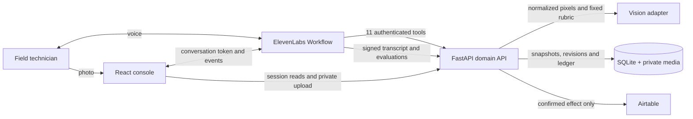
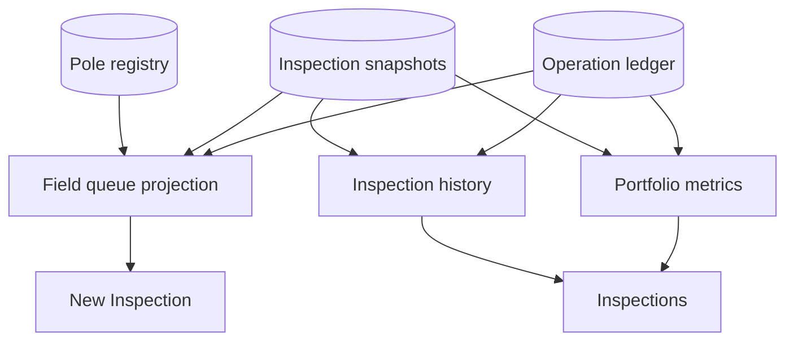
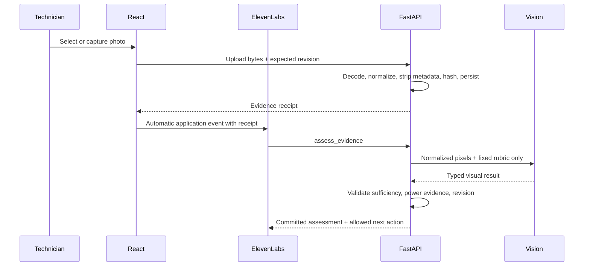
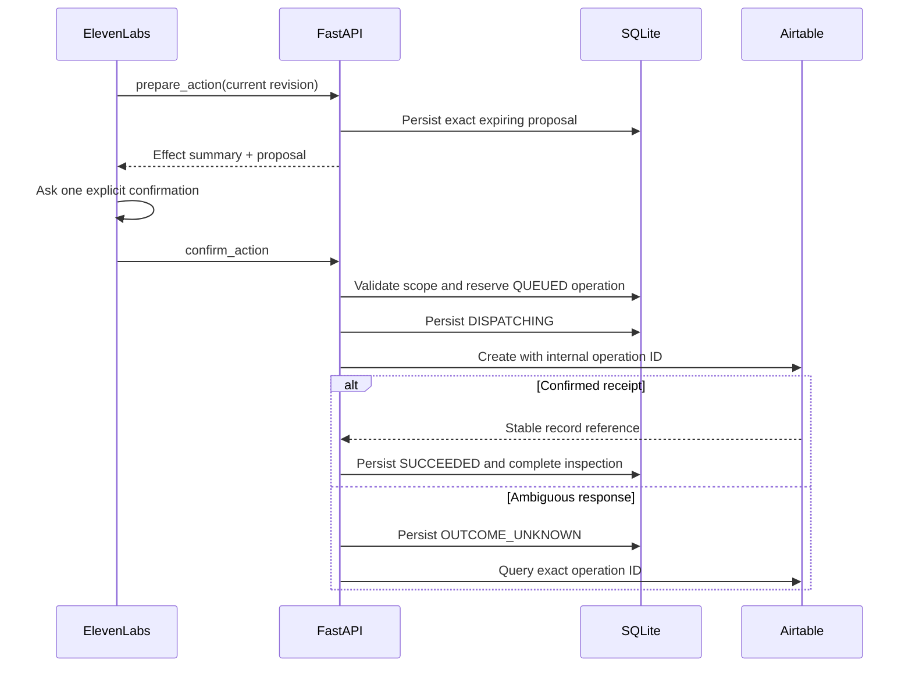

# LumaField — current architecture

**Version:** 0.3 · 9 September 2026

**Status:** implemented take-home demo

**Runtime HTTP contract:** FastAPI `/openapi.json`

## 1. Architecture in one sentence

ElevenLabs owns live conversation and staged orchestration; LumaField owns asset truth, evidence custody, deterministic reconciliation, and external-operation integrity.



No visual request receives the technician's claim, registry record, work order, pole number, previous assessment, or desired result.

## 2. Implemented decisions

| ID | Decision | Consequence |
|---|---|---|
| ADR-01 | Native ElevenLabs Workflow | Conversation authority is restricted by stage instead of one global prompt/tool surface. |
| ADR-02 | Asset/pole is persistent; inspection is an event | The same physical asset can accumulate an auditable history. |
| ADR-03 | Registry precedes field observation | The agent can state what the system believes and ask one bounded comparison question. |
| ADR-04 | Private, blinded vision adapter | Evidence classification cannot anchor on operator or registry claims. |
| ADR-05 | Backend reconciliation | The LLM orchestrates but cannot manufacture final classification, wattage, energy delta, eligibility, or action. |
| ADR-06 | Progressive client disclosure | UI components appear from authoritative workflow state, not from optimistic browser state. |
| ADR-07 | Proposal-scoped confirmation | One explicit confirmation authorizes one exact, current external effect. |
| ADR-08 | Durable operation ledger | `OUTCOME_UNKNOWN` blocks blind retries and keeps external claims honest. |
| ADR-09 | Deterministic portfolio projection | Aggregate questions and queue/history screens share persisted source-of-truth data. |
| ADR-10 | Signed post-call ingestion | Conversation transcript, agent version, and success evaluations join the inspection dossier. |

## 3. Two product read models

The same persisted state feeds two client surfaces:



`New Inspection` is optimized for action. `Inspections` is optimized for reading and audit. The queue uses each asset's newest persisted inspection and associated operation. History contains inspection events rather than synthetic asset summaries. Portfolio metrics count all persisted inspections except superseded identity attempts.

Current browser polling is intentionally simple for five demo assets. A production topology would condition refresh by active surface or publish state changes through SSE/WebSocket.

## 4. Session bootstrap and conversation binding

1. Vite's server-side proxy adds the demo access credential to `POST /v1/sessions`; it is not stored in browser `sessionStorage` or shipped in the bundle.
2. FastAPI creates an application session and mints short-lived browser/tool capabilities plus an ElevenLabs conversation credential.
3. React starts the conversation with `secret__lumafield_session` for authenticated tool headers.
4. The SDK exposes the real Conversation ID; React binds it to the local session.
5. The first authenticated tool call verifies the same binding using `system__conversation_id`.
6. Cross-session inspection/evidence/proposal access is rejected.

Agent webhooks require:

- `X-Agent-Key` from an ElevenLabs workspace secret;
- `X-Tool-Session` from the secret dynamic variable;
- `X-Conversation-Id` injected by the platform.

## 5. Workflow topology

The product communicates six business stages while the ElevenLabs graph combines record narration and field observation in one conversational node to avoid an unnecessary transfer delay:

```text
01 IDENTIFY
02–03 UTILITY RECORD + FIELD OBSERVATION
04 EVIDENCE
05 RECONCILE (mandatory dispatch tool)
06 RESOLVE
```

Stage-scoped authority:

| Stage | Relevant tools/knowledge |
|---|---|
| Identify | `get_asset_record`, `get_inspection_summary`, `start_inspection` |
| Record + Field | `record_field_observation`, field guide KB |
| Evidence | `assess_evidence`, `get_inspection_state`, response compatibility tool, both KB documents |
| Reconcile | mandatory `05_RECONCILE` dispatch |
| Resolve | `prepare_action`, `confirm_action`, `get_operation_status`, `get_asset_record`, `get_inspection_summary`, reconciliation KB |

The base agent does not load live asset records from Knowledge Base. Tools return current operational truth.

## 6. Evidence lifecycle



Evidence and assessment are different records. A browser event cannot inject a visual conclusion. Duplicate normalized pixels are idempotent inside one inspection and cannot be reused as if they belonged to another pole.

The authenticated, revision-scoped upload binds the photo to the active inspection. Visual analysis does not compare text in the image with the pole number: equipment serials, model numbers, barcodes and electrical ratings are evidence about the luminaire, not reliable work-unit identity.

A general photo may establish technology. A label photo may establish rated power. Neither is coerced into proving the other's claim.

## 7. Reconciliation boundary

`05_RECONCILE` reads only committed backend state:

- fixture binding and identity;
- registry and operational snapshots;
- original field observation;
- all committed assessments;
- current revision and remaining attempts;
- existing action/contract information where applicable.

It persists a decision with:

- reconciliation status;
- final field classification or unresolved state;
- technology and power match status;
- registered and observed loads;
- power and estimated cycle-energy deltas when supported;
- reason codes;
- downstream action and allowed next transitions.

For workflow v2, a registry mismatch always routes to `CREATE_REGISTRY_REVIEW`. A matching legacy fixture may independently qualify for `CREATE_REPLACEMENT` only after the registry has been confirmed.

## 8. Proposal and operation boundary



Provider I/O occurs outside the SQLite write transaction. This prevents long-held locks but creates an unavoidable distributed-systems boundary, modeled explicitly through the operation ledger.

An active/succeeded operation with the same business key blocks a duplicate. A successful claim requires an actual Airtable record reference.

## 9. Storage model

The implementation uses SQLite in WAL mode and private normalized media files. Core persisted records are:

- sessions and Conversation ID binding;
- inspection snapshots with monotonic revision;
- evidence and normalized-pixel hashes;
- typed visual assessments;
- append-only events;
- exact expiring proposals;
- confirmations;
- external operations and receipts;
- post-call transcript/evaluation payloads.

The current single-process lock around assessment avoids duplicate model work. Multiple application replicas would require shared storage, a durable job/lock mechanism, and a shared transactional database.

## 10. HTTP surface

The running FastAPI application generates the authoritative OpenAPI contract at `/openapi.json`.

| Method and path | Caller | Purpose |
|---|---|---|
| `POST /v1/sessions` | Client proxy | Create application/voice session |
| `POST /v1/sessions/{id}/bind` | Browser | Bind real Conversation ID |
| `GET /v1/sessions/{id}` | Browser | Read active session/inspection state |
| `GET /v1/assets` | Browser | Read live field-queue projection |
| `GET /v1/assets/{pole_id}` | Browser | Read one pole dossier without changing workflow state |
| `POST /v1/asset-records/lookup` | Agent | Query one pole dossier with a typed tool body and read-only semantics |
| `GET /v1/analytics/inspections` | Browser or agent | Read deterministic portfolio totals |
| `GET /v1/inspections` | Browser | Read persisted inspection dossiers |
| `POST /v1/inspections/start` | Agent | Bind pole and load registry/context |
| `POST /v1/inspections/{id}/field-observation` | Agent | Preserve technician report |
| `POST /v1/inspections/{id}/evidence` | Browser | Persist normalized photo |
| `POST /v1/inspections/{id}/assessments` | Agent | Run blinded vision assessment |
| `POST /v1/inspections/{id}/reconcile` | Agent | Persist deterministic decision |
| `POST /v1/inspections/{id}/operator-responses` | Agent | Compatibility/exception human response |
| `POST /v1/inspections/{id}/proposals` | Agent | Prepare exact effect |
| `POST /v1/proposals/{id}/confirmation` | Agent | Confirm/decline and dispatch |
| `GET /v1/operations/{id}` | Agent | Read/reconcile operation outcome |
| `GET /v1/inspections/{id}` | Browser or agent | Recover authoritative dossier |
| `POST /v1/webhooks/elevenlabs/post-call` | ElevenLabs | Attach signed transcript/evaluations |

## 11. Verification and observability

One Conversation ID connects the live voice session, tool calls, inspection, evidence, operation, transcript, and post-call evaluations.

Versioned manifests cover agent prompt/config, Workflow, tools, Knowledge Base, native tests, and success criteria. Provisioning is idempotent; verification reads live state back and executes:

- `12/12` catalog smoke;
- `3/3` golden-path simulation;
- `30/30` critical stability runs.

Local tests cover session scope, evidence isolation, revision conflicts, reconciliation, queue/history/summary projections, proposal confirmation, external ambiguity, signed post-call ingestion, and provisioning payloads.

## 12. Honest production boundary

The architecture is production-minded, not a claim of production deployment. A real municipal rollout would replace fictional business data, local media and SQLite; add workforce identity, device/location policy, shared storage, durable queues, stable HTTPS deployment, tariff/date rules, monitoring, retention controls, and human review operations.
